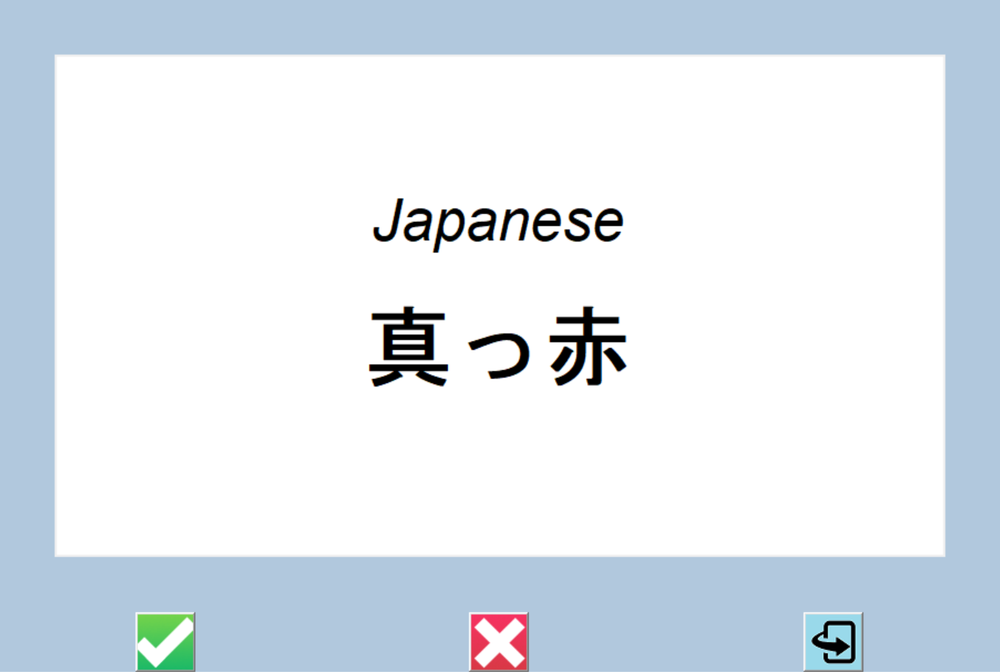

# Flashcard App

## Table of Contents
1. [URL](#url)
2. [Description](#description)
3. [Installation](#installation)
4. [Usage](#usage)
5. [Credits](#credits)

## URL 

Due to the nature of this project, the code has not been deployed. However, the repository can be found at https://github.com/Spacepineapple/flashcard-app

## Description 

This is a flashcard app to support language learning. The is designed to allow learning of Kanji and Japanese phrases, but will accept any other language pair as long as the input file conforms to the correct format -- please see the CSV files in the data folder for an example. The app displays words and phrases in the target language to the user who is able to flip the card to see an English translation, to mark the word as one they got correct or to mark the word as incorrect. Marking the word as incorrect removes it from the CSV of words to learn -- however, to prevent the source data from being modified, I have introduced functionality to create a subset of the source data for manipulation. As a result, if the user wishes to revert to using the original data, they may do so. A screenshot of an example flashcard can be seen below:

## Installation 

To install the app, simply download the repository and unzip the files. Please note that the game requires installation of Python.

## Usage 

To use the app, first download the repository and unzip the files. Following this, run the main.py file and a Japanese word or phrase will be chosen at random and displayed in the app. The green tick button can be used to indicate correct recall of the phrase and to remove it from the app, while the red cross button can be used to indicate incorrect recall of the prhase. Either of these buttons will also generate a new word or phrase and display it to the user. The user can also use the blue button to flip the card to see the English translation if they wish.

## Credits 

This project was built by myself. The project idea and code was based on an activity in Dr. Angela Yu's 100 Days of Code course on Udemy, however, I have made substantial modifications to the code including adding the flip card functionality and to more dynamically generate interface elements based on the input data. I have also made modifications to the layout to better support Japanese text. Icons were provided by Dr. Yu or sourced from free icon services. While I have made a number of modifications to the flip icon button, I did not create it and claim no credit for it.